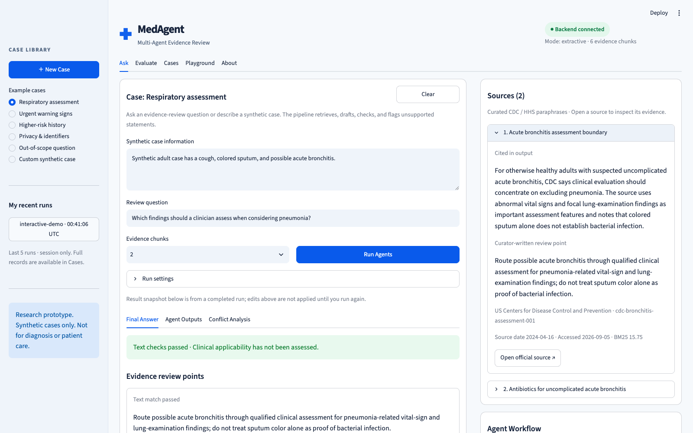

# MedAgent — Evidence-Grounded Healthcare Agent

A small, inspectable multi-agent system for evidence review. It retrieves relevant guidance,
creates citation-bound review points, verifies every claim against its cited evidence, and flags
unsupported or contradictory output.

> **Safety:** This repository is an educational engineering demo. Cases are synthetic. Knowledge
> chunks are curator-written paraphrases of linked public sources, not a substitute for those
> sources or for clinical judgment. The system must not be used for diagnosis or care.



## Demo and measured results

- [Offline challenge report](reports/offline-20260907T235426Z/README.md): 20 development checks,
  **15 matched expectations, 5 exposed known limitations**, zero model API calls.
  The 75% expectation match rate is not medical accuracy; unmet cases are retained in the report.
- [Offline baseline report](reports/baseline-2026-09-05/README.md): six synthetic cases,
  complete per-case results, data/code hashes, and runtime metadata.
- [Demo video and reproduction guide](docs/demo.md): actual browser interactions, English
  synthesized narration, and subtitles. The recording is an offline prototype walkthrough.
- [Local Docker verification](docs/deployment-check.md): isolated API/UI startup and browser smoke test.

| Offline observation | Result |
| --- | --- |
| Retrieval Recall@1 / expected citation-ID precision | 100% / 100% on six curated smoke cases |
| Rule text-match rate | 100%; expected for the extractive baseline |
| Deliberately injected error checks | Both detected |
| Unrelated-input check | Abstained without generating claims |
| Clinical accuracy / independently measured hallucination rate | Not measured |

The baseline table is not a model leaderboard. The smoke cases are curated around the small
corpus, and the reasoner reproduces curated text. See the report for methodology and limitations.

## Why this project exists

Many RAG demos stop after producing a plausible answer. This project makes the quality controls
visible:

1. A **Retriever** ranks evidence with a dependency-free BM25 implementation.
2. A **Reasoner** emits structured claims that must carry citation IDs.
3. A **Verifier** labels each claim `supported`, `unsupported`, or `contradicted`.
4. A deterministic **Conflict Detector** converts verification failures into review warnings.
5. An evaluation runner reports retrieval, citation, grounding, conflict, and latency metrics.

The project runs without an LLM or API key by default. An optional model-backed reasoner uses the
OpenAI Responses API with Structured Outputs, while the extractive baseline keeps orchestration,
schemas, tests, and evaluation reproducible offline.

**New core capability (2026-09-07):** optional bounded adaptive orchestration. A model selects
supplementary local searches, drafting, clarification, or abstention. Claims receive semantic
checks plus deterministic citation/quote validation; a failed draft can be repaired once and
rechecked. Failed candidates remain in the audit trail and are withheld from the final answer.
This path has scripted integration tests, **not live model-quality validation**.
See [adaptive architecture, limits, and evaluation instructions](docs/adaptive-agent.md).

## Quick start

```bash
# Run from the repository root.
make setup
make api-offline
```

In another terminal:

```bash
# Run from the repository root in a second terminal.
make ui
```

Open the API docs at `http://localhost:8000/docs` or the UI at `http://localhost:8501`.

`make api-offline` explicitly selects the extractive baseline even if your shell was previously
configured for a model. It does not erase or print any API key. In **Evaluate → Run Offline Checks**,
the new challenge suite always runs without a model, independently of the active backend mode.

To generate a saved report without starting either server:

```bash
make offline-eval
```

This command creates a new report directory and never overwrites earlier runs. See
[zero-cost evaluation and error handling](docs/offline-evaluation.md) for scope and limitations.

### Enable the model-backed reasoner

The default `REASONER_MODE=extractive` does not make external calls. To enable the optional model
adapter, choose a model available to your API project and set the variables in your shell:

```bash
export REASONER_MODE=openai
export OPENAI_MODEL='your-model-id'
export OPENAI_API_KEY='your-api-key'
make api
```

The API key stays in the environment and must not be committed. Model responses are requested with
`store=False`. The adapter rejects citation IDs that were not present in the retrieved evidence.

### Enable the adaptive pipeline

Keep the model/key configured as above, then set `PIPELINE_MODE=adaptive` before starting the API.
The existing `PIPELINE_MODE=baseline` remains the default; it can use either the extractive or
single-pass model reasoner. Adaptive mode requires `REASONER_MODE=openai` and does not silently
fall back to offline responses. The same UI shows the active mode and completed action trace.

Start with a non-billable configuration preview:

```bash
.venv/bin/python -m scripts.compare_modes
```

It checks configuration presence only, not key validity or model access. After reviewing that
preview, see [the live-run instructions](docs/adaptive-agent.md#first-real-model-check) to opt in
to a one-case baseline/adaptive comparison. The default upper bound is seven model calls per case.
Only synthetic cases should be sent. No `.env` file is automatically loaded by `make api`.

You can also run both services with:

```bash
docker compose up --build
```

Docker Desktop must be running. Dependencies and UI files are included in the image; no source
mount or runtime package installation is required. Both services have health checks and run as
a non-root user. If the default ports are already occupied:

```bash
API_PORT=18000 UI_PORT=18501 docker compose up --build -d --wait
```

In that case, open the UI at `http://localhost:18501`. Published ports bind only to localhost.
Stop this Compose project's containers with `docker compose down`; this does not stop the
separately launched `make api` / `make ui` processes.

### Tests and a saved evaluation report

```bash
make test
make lint
make report
```

`make report` creates a new timestamped folder under `reports/` containing Markdown and JSON.
It explicitly uses the offline reasoner regardless of model-related shell settings and makes
no provider API calls. In contrast, the API/UI evaluation action uses the active backend mode.

## Example request

```bash
curl -s http://localhost:8000/v1/reviews \
  -H 'Content-Type: application/json' \
  -d '{
    "case_id": "demo-001",
    "patient_summary": "Synthetic adult case reports difficulty breathing and persistent chest pain today.",
    "question": "Which issue should be handled first?",
    "top_k": 1
  }'
```

Run the bundled evaluation set:

```bash
curl -s -X POST http://localhost:8000/v1/evaluations/run
pytest
```

## Current scope

- Six curator-written evidence chunks derived from three linked CDC and HHS source pages
- Source publisher, URL, update date, access date, jurisdiction, and paraphrase status
- Lexical BM25 retrieval with an auditable score breakdown
- Extractive baseline plus optional structured-output OpenAI reasoner
- Optional adaptive planner, up to two supplementary local searches, and one repair/recheck
- Claim-level rule verifier or semantic verifier with exact quote/citation checks
- FastAPI endpoints, Streamlit UI, tests, and Docker configuration
- Reproducible offline evaluation cases
- Separate 20-case offline challenge suite with visible expected-versus-observed outcomes
- Sanitized error categories for credits, quota, throttling, timeout, authentication and server errors
- English three-column workbench: case library, evidence review, and source/workflow/metric panels
- Ask, Evaluate, Cases, Playground, and About navigation with claim-level output tabs
- Fixed offline fault-injection demo (a known counterexample and a nonexistent citation)
- Downloadable run and evaluation JSON

## Demo walkthrough

Open the workbench and run a synthetic case. Compare the candidate statements on the left with
the retrieved evidence on the right. The workflow panel shows measured durations after completion;
they are not a live stream or a visualization of hidden model reasoning.

In **Playground**, click **Run Conflict Demo** to execute a fixed offline example. It adds two
deliberately incorrect statements, then runs the real verifier and conflict detector. One
matches a curated counterexample and one cites a nonexistent source. This does not measure
natural model failures and does not alter the normal review endpoint. The original review point
is shown next to the flagged claim. Recent runs remain in the browser session (up to five).

The **Evaluate** tab runs the current backend reasoner on the small synthetic smoke set.
If the backend is configured for a model provider, that action makes billable API calls.

## What verification means here

The offline verifier preserves word order and negation. It accepts only an exact normalized
match to a curated sentence or review point, rejects missing citations, and recognizes exact
matches to curator-written counterexamples. Other wording is marked unsupported for further
review. This deliberately conservative check does not establish clinical applicability or
semantic entailment. It may flag valid model paraphrases.

The API retains the legacy `hallucination_rate` field for compatibility, but it means the
fraction of final candidate claims not passing the active checker, not an independently
validated hallucination rate. Adaptive mode additionally preserves pre-repair failure metrics,
all candidate attempts, abstentions, errors, model calls and provider token totals. Its model
judge can accept paraphrases but can also share the reasoner's errors. It is not independent
clinical validation. Missing provider usage is labeled partial/unavailable, never priced as free.
The six-case smoke set cannot establish clinical accuracy. Retrieval Recall@K now uses all
retrieved chunks, independently of which three claims the extractive reasoner emits. Citation
precision compares used citation IDs against expected IDs; it is not an entailment metric.

See [architecture and demo script](docs/workbench.md) for the walkthrough and next design steps.
See [milestone status](docs/progress.md) for what is complete and what remains before a portfolio release.

## Public sources

- [CDC — About Respiratory Illnesses](https://www.cdc.gov/respiratory-viruses/about/index.html)
- [CDC — Outpatient Clinical Care for Adults](https://www.cdc.gov/antibiotic-use/hcp/clinical-care/adult-outpatient.html)
- [HHS OCR — Guidance Regarding Methods for De-identification of Protected Health Information](https://www.hhs.gov/hipaa/for-professionals/special-topics/de-identification/index.html)

The repository stores concise curator-written paraphrases, not scraped page copies. Users can open
the source page from every citation card in the UI.

## Next milestones

1. Configure a real model and inspect the first adaptive run; no live test has been performed yet.
2. Build a human-reviewed gold set, including paraphrases, contradictions and insufficient evidence.
3. Benchmark quality/abstention against shared labels before claiming improvements; add verified
   model pricing and expand retrieval coverage when evidence warrants it.

## API

- `GET /health` — service and corpus status
- `POST /v1/reviews` — run the complete review pipeline
- `POST /v1/evaluations/run` — evaluate all bundled synthetic cases
- `POST /v1/evaluations/offline` — always-offline, 20-case engineering challenge suite
- `POST /v1/demos/conflict` — fixed offline fault injection, marked `is_demo=true`
