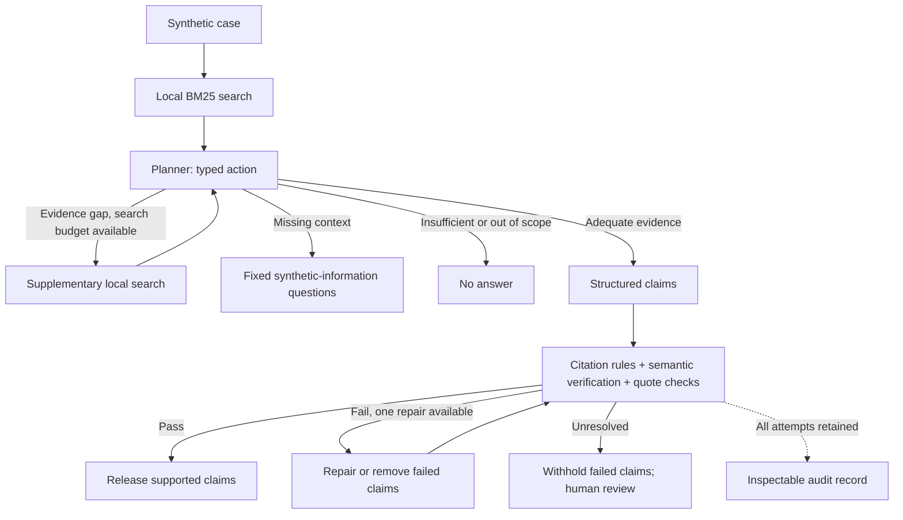

# MedAgent adaptive core v1

Implemented 2026-09-07. Engineering prototype; synthetic cases only, no patient care.

Update: a subsequent user-initiated live pilot stopped at its first planner call with HTTP 429;
no usable model output was received. The user chose not to recharge. The current path is
[zero-cost evaluation and improved error diagnostics](offline-evaluation.md), with 94 passing
automated tests. The original implementation snapshot and optional live instructions below
do not mean that a successful model-quality evaluation has occurred.

## What changed

| Capability | Baseline (still the default) | Optional adaptive pipeline |
| --- | --- | --- |
| Retrieval | One BM25 query | Initial query plus up to two model-selected supplementary queries |
| Next action | Fixed pipeline | Typed planner action: search, draft, clarify, abstain |
| Reasoning | Extractive or single model draft | Structured model draft; at most three atomic claims |
| Verification | Exact text / known counterexample rules | Citation rules, separate semantic model call, exact quote checks |
| Failed claims | Flagged as candidates | One repair, reverify, withhold unresolved claims from final output |
| Audit | Four role outputs | Queries, action decisions, both drafts, checks, usage and stop reason |



This is a bounded controller, not an unrestricted autonomous agent. The planner returns structured
actions and Python dispatches the allowlisted `search_local_evidence` operation. It does not use
native function-call messages, execute code, browse URLs, or mutate records. Retrieval remains
BM25 over six curated chunks: no embeddings, new source ingestion, or web search was added.

## Verification contract

- Unknown, missing or duplicate citation IDs cannot receive model approval.
- Curator-authored known counterexamples remain deterministic rejection fixtures; they are not
  supplied as authoritative evidence to the semantic judge.
- The judge receives the case, question, claims and only their cited evidence—not the author's
  confidence or an unverified narrative summary. Roles use the same configured model with separate
  prompts, so their errors may be correlated.
- Every submitted claim must have exactly one matching check. Missing, foreign or duplicate check
  IDs fail closed. Incomplete, refused, malformed or failed model responses never become an answer.
- A supported claim needs exact contiguous quotes covering every cited document. A contradiction
  needs a quote from at least one cited document. Only whitespace is normalized for quote matching.
  Invalid quotes downgrade the claim to unsupported.
- Exact quotes establish that the quoted text exists, **not that it entails the claim**. Entailment
  and question relevance still depend on the fallible model judge. No clinical accuracy is claimed.
- `claims` contains only the released supported subset in adaptive mode. `verification` and
  `conflicts` describe the last candidate attempt, including withheld claims. Use `attempts` to
  recover those candidates and the pre-repair draft. Baseline response semantics are unchanged.
- The case summary is the user's synthetic input, not a generated conclusion that bypasses
  verification. Clarification questions come from a fixed field vocabulary.

## Execution limits and privacy

Default per-review limits in `AgentLimits`:

| Limit | Value |
| --- | --- |
| Model calls, all roles combined | 7 |
| Local searches, including the initial one | 3 |
| Evidence chunks retained | 8 maximum; bundled corpus currently contains 6 |
| Repair attempts | 1 |
| Output tokens per model call | 2,048 |
| Instructions + serialized input | 32,000 characters per call |
| SDK request timeout | Up to 20 seconds, shortened by the remaining run budget |
| Run time budget | 90 seconds, checked between calls and after responses |
| Automatic SDK retries | 0 |

The time budget is cooperative, not a hard process-kill deadline: HTTP transport timeouts and
provider cancellation have their own behavior. Call/output limits bound work, not exact dollars;
input tokens and model pricing vary. A timed-out provider request may still be billable.

Usage totals include planner, draft, semantic verification and repair calls. Missing usage is
`partial_or_unavailable`; reported counts then represent only observed usage. Cost is **Not priced**
until model prices are configured. Logs contain failure types, not provider bodies or case prompts.
Exported review records intentionally contain the synthetic input and candidate text; do not put
real patient information into the app. Model calls request `store=False`, which does not by itself
establish zero retention or regulatory compliance.

## First real model check

The environment inspected during implementation did not have `OPENAI_MODEL` or `OPENAI_API_KEY`.
No live provider request was made and no model-quality or cost result was invented.

1. From the project directory, configure an API-accessible model supporting Responses structured
   outputs and its API key in your local shell. Do not paste the key into chat or commit it.
2. Run `.venv/bin/python -m scripts.compare_modes` to preview: one case, maximum seven model calls,
   and booleans indicating whether configuration is present. This is **not** a connectivity test.
3. Explicitly opt in to a live one-case run (billable):

   ```bash
   .venv/bin/python -m scripts.compare_modes --allow-model-calls --case-limit 1 \
     --output reports/first-adaptive-live-run
   ```

   The output directory must not exist. The script checkpoints raw results after each case and
   stops after a provider/budget error; inspect the record before retrying. A larger run can select
   up to six cases with `--case-limit 6` (maximum 42 model calls).

4. To use adaptive mode in the English UI, restart the API in its own terminal after stopping that
   terminal's previous process with Ctrl+C:

   ```bash
   REASONER_MODE=openai PIPELINE_MODE=adaptive make api
   ```

   Do not start another server on an occupied port. Keep the UI in the second terminal (`make ui`).
   `/health` must report `pipeline_mode: adaptive`; a connected backend alone does not test model
   access. Compose accepts the same environment variables. Shell `.env` files are not auto-loaded.

5. Return to offline mode with `REASONER_MODE=extractive PIPELINE_MODE=baseline make api` after
   stopping the previous API process. `make report` always runs the explicit offline baseline.

## Evaluation and verified scope

As of this implementation, **57 automated tests pass**, including **35 new scripted tests** for
the adaptive flow, API serialization, UI repair/audit rendering, partial outputs, citations,
quotes, bounded retries, failure handling, concurrent request isolation and comparison dry-run.
Scripted model responses test program behavior; they do not establish that a real model chooses
the right action, detects contradictions, resists prompt injection, or improves answer quality.

The six existing smoke cases remain the evaluation data. No independent clinical gold set was
added. The comparison tool exports both complete outputs, source/code hashes and raw per-attempt
checks so a reviewer can label them later. The current support scores use different checkers in
the two modes and must not be treated as an apples-to-apples quality improvement.

Relevant metrics:

- `initial_supported_claim_rate` / `initial_flagged_claim_rate`: pre-repair checker outcomes.
- `supported_claim_rate`: last candidate checks, including withheld candidates.
- `withheld_claims`, `released_claims`, `abstention_case_rate`, `error_case_rate`: expose suppression
  and failed runs so abstaining on everything cannot masquerade as successful accuracy.
- `repair_attempts`, `model_calls`, `search_calls`, per-role latency and provider token counts.
- The legacy `hallucination_rate` is still a checker-failure proxy, not measured hallucination.

Existing recorded video and the September 5 report demonstrate the **offline baseline**, not this
new adaptive path. Docker was not rerun for this change; its earlier verification is historical.

Next quality gate: a small real-model pilot, followed by independently labeled questions/claim
pairs covering supported paraphrases, negation, incomplete evidence, distractors and out-of-scope
requests. Compare all modes against those shared labels before writing improvement percentages.

## API references used

The implementation retains the SDK `responses.parse` / Pydantic interface and handles unusable
or refused outputs explicitly, following the [official Structured Outputs guide](https://developers.openai.com/api/docs/guides/structured-outputs).
Structured formatting is not evidence validation; deterministic checks remain in application code.
