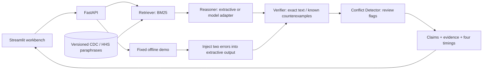

# MedAgent workbench

## Interface

The English UI follows a three-column research workspace:

- **Left:** synthetic case presets, New Case, and the last five session runs.
- **Center / Ask:** editable case and question, Run Agents, Final Answer, Agent Outputs,
  and Conflict Analysis. "Final Answer" contains candidate review points, not medical clearance.
- **Right:** expandable attributed Sources, a measured Agent Workflow, and Run Metrics.
- **Evaluate:** execute the six-case smoke set and export its result table.
- **Cases:** inspect and export recent snapshots; records are not persisted to a patient database.
- **Playground:** run the explicit offline fault-injection demo.
- **About:** scope, limitations, and honest milestone status.

Selecting a different preset clears the active result to avoid pairing a new case with an old
answer. Restoring a normal run also restores its submitted input. Ordinary reruns preserve
history; New Case and Clear do not delete prior snapshots. Blank inputs are validated locally.

The reference image informs layout and color, not medical claims or unsupported features.
There is no PDF upload, all-domain selector, fabricated accuracy score, or "all agents online"
claim. Connection status comes from the API. Offline model API cost is zero; model-mode pricing
is shown as unavailable until actual usage can be combined with a price configuration.

## Architecture

These are modular pipeline roles, not three autonomous LLMs. Only the optional Reasoner currently
uses a model. The verification method and execution mode are recorded in each run. A rule match
means a claim reproduces a curated statement; it does not mean that statement applies to a patient.

## Two-minute recording script

The recorded MP4, English narration, subtitle details, and reproduction commands are documented
in [demo.md](demo.md). A dated report is saved under `reports/baseline-2026-09-05/`.

1. **0:00–0:20** — Show the workbench and active `extractive` mode. State that cases are synthetic
   and evidence consists of attributed CDC/HHS paraphrases.
2. **0:20–0:45** — In Ask, click Run Agents. Show four measured component durations and the claim/source
   pairing. Open the official source link if desired.
3. **0:45–1:15** — In Playground, click Run Conflict Demo; return to Ask → Conflict Analysis.
   Show the explicit demo banner, known
   counterexample, missing citation and two review flags. Explain that the errors are deliberate.
4. **1:15–1:40** — In Evaluate, click Run Evaluation. Explain Recall@K and citation-ID precision, and that
   text-match success is not clinical accuracy. The small fixture is a smoke test.
5. **1:40–2:00** — Show Cases and JSON export. Describe the next experiment: compare
   model reasoning with the baseline on an independently labeled set containing negations,
   insufficient evidence and valid paraphrases.

## Next experiments

- Semantic verification needs its own labeled claim/evidence pairs. Evaluate both missed errors
  and false alarms before using it to filter an answer.
- Agent disagreement should distinguish a verifier's uncertainty from a directly conflicting
  statement. The current demo flags rule failures, not a general inter-agent conflict rate.
- Expand retrieval with distractors and out-of-scope cases; do not tune and report on one tiny set.
- Cost reporting needs actual provider usage and a dated price configuration. Offline text-length
  estimates are not billable tokens.
- The current UI uses synchronous requests with completed-run cards. Genuine progress streaming
  would require backend events; no artificial stage animation is used.

## Local development

From the repository root, run `REASONER_MODE=extractive make api` and `make ui` in two terminals.
If ports 8000 / 8501 already have healthy project services, refresh the existing page. If a restart
is needed, stop the relevant terminal process with Control-C before launching it again.

`make test` includes API/verification regression tests and, when Streamlit is installed, a
workbench interaction test covering demo execution, history persistence, evaluation, and a failed
request. Model adapter tests use mocks; no real model quality is claimed.
